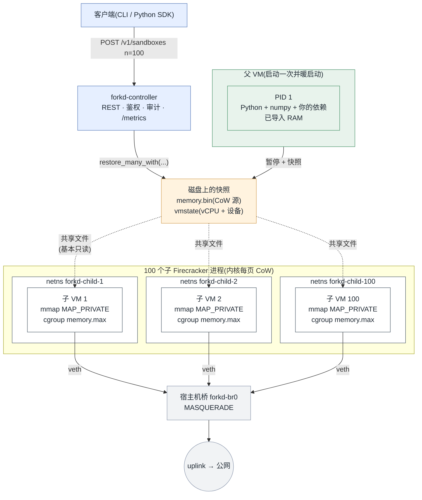

<br/>

<div align="center">
  <picture>
    <source media="(prefers-color-scheme: dark)" srcset="docs/logo-dark.svg">
    
  </picture>
</div>

<br/>
<br/>

<p align="center">
  <a href="https://github.com/deeplethe/forkd/actions"></a>
  <a href="https://github.com/deeplethe/forkd/releases"></a>
  <a href="https://pypi.org/project/forkd/"></a>
  <a href="./LICENSE"></a>
  <a href="./README.md"></a>
  <a href="https://github.com/deeplethe/forkd/stargazers"></a>
</p>

<br/>

## 101 毫秒,fork 出 100 个 microVM。

面向 **AI Agent 扇出**(fan-out)场景的 microVM 沙箱运行时。子 VM
从一个已"暖启动"的父快照 fork 而来,通过写时复制(CoW)继承
父进程的地址空间,而不是冷启动一个新内核。

forkd 基于 Firecracker 构建。父 VM 启动一次,把运行时(Python +
依赖,JIT 已暖的 JVM,已加载的 ML 模型)导入内存,然后暂停并落盘。
每个子 VM 是一个独立的 Firecracker 进程,通过 `MAP_PRIVATE`
方式 `mmap` 父快照的内存镜像;内核在页面级别实现写时复制,因此
在子 VM 发生写入分歧之前,它们共享父 VM 的常驻内存。

由此同时获得两个特性:**每个子 VM 都是独立的 KVM 隔离**,
同时**单个子 VM 的启动成本接近 `fork(2)`,而非冷启动 VM**。

<br/>

## 关键特性

- **硬件级隔离。** 每个子 VM 都是独立的 Firecracker microVM,
  基于 KVM。要逃逸出来需要 hypervisor 或内核漏洞,而不是
  `runc` 的一个回归 bug。
- **暖启动的运行时免费继承。** 导入、JIT 编译、模型权重、预取的
  缓存——只要父 VM 做过的事,子 VM 直接拿到。
- **每个子 VM 都是真 Linux。** 多 vCPU、完整 TCP 网络、`apt
  install`、出站 HTTPS。和那些为了极致启动速度牺牲掉
  单 vCPU + 串行 I/O 的函数级快照运行时不同,forkd 的子 VM
  可以跑真实的 Python 服务、模型推理或任何需要完整内核的负载。
- **从设计上就是多租户。** 每个子 VM 独立 network namespace、
  独立 cgroup v2 内存限制、独立 `/dev/urandom`(Linux 5.20+
  通过 `vmgenid` 重新播种)。
- **为 Agent 扇出而生。** 单次请求扇出到大量短生命周期沙箱的
  AI Agent 负载——代码解释器、工具调用、评估 rollout——是
  设计目标。暖启动的父 VM 把每次请求的 `import numpy` /
  `import torch` 开销在整个 cohort 间分摊到接近零。
- **可运维。** 守护进程持有状态、REST API(Unix 或 TCP)、
  Prometheus `/metrics`、append-only JSON 审计日志、systemd 单元。
- **开源。** Apache 2.0,没有厂商 SDK 锁定。

<br/>

## 基准测试

同一台 Linux 主机(Ubuntu 24.04,Linux 6.14,20 vCPU,30 GiB,KVM)。
负载:启动 100 个沙箱,每个执行 `import numpy;
numpy.zeros(5).tolist()`。


| 后端 | N=100 总耗时 | 每个沙箱内存增量 | 说明 |
|---|---:|---:|---|
| **forkd** | **101 ms** | **0.12 MiB** | 从暖启动快照 CoW fork |
| CubeSandbox¹ | 20.3 s | 5 MiB | RustVMM microVM,冷启动 |
| BoxLite² | 113.2 s | — | KVM microVM,冷启动 OCI rootfs |
| OpenSandbox³ | 122.0 s | — | 经抽象层调用 Docker 运行时 |
| Firecracker 冷启动 | 759 ms | 84 MiB | 裸 VM 启动,无编排 |
| gVisor (runsc) | 288.6 s | — | 用户态内核容器 |
| Docker (runc) | 335.3 s | 4 MiB | 标准容器运行时 |

¹ CubeSandbox:100 个沙箱里 77 个干净启动,其余在本机并发负载下
撞到 reflink-copy 存储错误。详见
[`bench/CUBESANDBOX.md`](./bench/CUBESANDBOX.md)。

² BoxLite 的设计目标是每个负载一个长生命周期、有状态的 Box,
而不是 100 个并发的全新 microVM。冷启动扇出数据放在这里仅为
直接对比。详见 [`bench/BOXLITE.md`](./bench/BOXLITE.md)。

³ OpenSandbox 是 Docker / K8s / gVisor / Kata / Firecracker 上层的
抽象层;此处数字是它默认的 Docker 运行时。详见
[`bench/OPENSANDBOX.md`](./bench/OPENSANDBOX.md)。

复现:`bench/bench-spawn-100.sh` 然后 `bench/generate_charts.py`。

对单个沙箱执行同一个 numpy 表达式的两种方式:

| 调用 | 耗时 | 做了什么 |
|---|---:|---|
| `sandbox.eval("numpy.zeros(5).tolist()")` | 1 ms | 复用 PID 1 里已暖的 Python |
| `sandbox.commands.run("python3 -c '...'")` | 96 ms | 冷子进程重新 import numpy |

<br/>

## 工作原理



完整设计、以及当前架构留下的开放问题,见
[`DESIGN.md`](./DESIGN.md)。

<br/>

## forkd 与其他方案对比

沙箱运行时这个领域的设计差异很大。下表把 forkd 和最常被提及的
开源项目放在一起对比。引号内的数字是**上游项目自己公布的数字**,
除非已经在上面我们的基准图里。forkd 不会去测别的项目在它们
本来就不为之设计的负载形态。

| 项目 | 隔离原语 | 冷启动 (N=100) | Fork 自暖快照 | 配额 | 鉴权 / TLS | 协议 |
|---|---|---|:---:|---|---|---|
| **forkd** | Firecracker + 快照 CoW | **101 ms** | ✓ | cgroup `memory.max` | bearer + rustls | Apache 2.0 |
| [CubeSandbox][cs] | RustVMM + KVM microVM | 20.3 s¹ | "coming soon" | <5 MiB / 实例 | 闭源不开放 | Apache 2.0 |
| [Daytona][dy] | OCI workspace | <90 ms² | ✗ | 每 workspace | 平台 API key | **AGPL-3.0** |
| [OpenSandbox][os] | Docker / K8s + gVisor / Kata / FC | 122 s | ✗ | 取决于底层 | k8s 网关 | Apache 2.0 |
| [E2B][e2b] | Firecracker(在 [infra][e2b-infra] 中) | 开源不含 | ✗ | 平台侧 | 云 API key | Apache 2.0 |
| [BoxLite][bl] | KVM / Hypervisor.framework + OCI | 113 s | ✗ 有状态 Box | KVM + seccomp | 仅出站策略 | Apache 2.0 |
| Modal | 闭源快照 fork | 不公开 | ✓ | ✓ | ✓ | 闭源 |
| Firecracker 裸用 | 只有 microVM | 759 ms | 手工 | n/a | n/a | Apache 2.0 |
| Docker (runc) | OCI 容器 | 335 s | ✗ | cgroups | n/a | Apache 2.0 |
| gVisor (runsc) | 用户态内核 | 289 s | ✗ | cgroups | n/a | Apache 2.0 |

¹ 本机并发负载下 100 个里 77 个成功,因为撞到了 reflink-copy 的
存储 bug;CubeSandbox 自称单实例冷启动 **<60 ms**(50 并发时
P95 90 ms)。详见 [bench/CUBESANDBOX.md](./bench/CUBESANDBOX.md)。

² Daytona 自己公布的数字,我们没测它(workspace 运行时,不属于
可对比的扇出形态)。

[cs]: https://github.com/TencentCloud/CubeSandbox
[dy]: https://github.com/daytonaio/daytona
[os]: https://github.com/alibaba/OpenSandbox
[e2b]: https://github.com/e2b-dev/E2B
[e2b-infra]: https://github.com/e2b-dev/infra
[bl]: https://github.com/boxlite-ai/boxlite

**forkd 适合什么场景。**

- **代码解释器和 Jupyter kernel 沙箱。** 每一次对话或工具调用
  都开一个全新 kernel;暖启动的父 VM 带着 SciPy / ML 运行时,
  所以每次请求的 `import numpy` / `import torch` 直接降到零开销。
  这就是设计目标——Anthropic / OpenAI / Modal 的代码解释器
  产品全是这种负载形态。
- **评估测试集 harness。** 几百个仓库 checkout 或测试 rollout
  并行跑——SWE-bench 那种形状——又不用每个 task 付 Docker
  冷启动的代价。
- **大规模扇出的多用户代码执行。** 大量短生命周期沙箱共享
  同一个暖启动父 VM,每个子 VM 都是 KVM 隔离。
- **CI 里执行不可信代码。** `git clone`、`pip install`、
  `pytest` 跑在真实的 Linux VM 里,而不是一个容器 namespace。
- **托管沙箱 SaaS 的自托管替代品。** 一台 Linux + KVM,单二进制
  守护进程,Apache 2.0——没有按秒计费的云账单,也没有厂商锁定。

**别的项目更合适什么。** CubeSandbox:更快的纯冷启动(自称
<60 ms)。Daytona:每个用户拥有一个长生命周期沙箱的 workspace
形态。OpenSandbox:用一套编排 API 适配多种隔离后端。BoxLite:
可嵌入、不需要守护进程、跨平台(macOS 走 Hypervisor.framework)。
Modal:同一种原语的闭源托管版本。

**forkd 的不适用场景。** 函数级快照运行时为了极致启动速度
放弃了真实 Linux(单 vCPU、只有串行 I/O),它们能在 forkd 的
~100 ms 基础上再快一个数量级——代价是跑不了真实的 Python
服务、`apt install`、出站 HTTPS。

<br/>

## 快速开始

要求:x86_64 Linux,带 KVM,Ubuntu 22.04 或更新。

```bash
# 1. 主机准备:KVM、Firecracker、Rust、KSM、大页、tap 设备。
sudo bash scripts/setup-host.sh
sudo bash scripts/host-tap.sh
cargo build --release
sudo install -m 0755 target/release/{forkd,forkd-controller} /usr/local/bin/

# 2. 从一个 Docker 镜像构建暖启动 rootfs。
sudo bash scripts/build-rootfs.sh python:3.12-slim python-rootfs.ext4 1536 python3-numpy

# 3. 拉一个内核。
curl -O https://s3.amazonaws.com/spec.ccfc.min/firecracker-ci/v1.10/x86_64/vmlinux-6.1.141

# 4. 跑一个一次性沙箱。
sudo -E forkd run --image python:3.12-slim --kernel ./vmlinux-6.1.141 \
    -- python3 -c "import numpy; print(numpy.zeros(5).sum())"
# 0.0
```

### 多子 VM 扇出

```bash
# 一次性给 N 个子 VM 准备好网络 namespace。
sudo bash scripts/netns-setup.sh 100

# 创建一个带 tag 的父快照。
sudo forkd snapshot --tag pyagent \
    --kernel ./vmlinux-6.1.141 \
    --rootfs ./python-rootfs.ext4 \
    --tap forkd-tap0

# Fork 100 个共享父 VM 内存的子 VM。
sudo -E forkd fork --tag pyagent -n 100 --per-child-netns --memory-limit-mib 256

# 和其中一个子 VM 通信。
sudo forkd eval --child forkd-child-42 -- "numpy.zeros(100).sum()"
```

### Python SDK

```python
from forkd import Sandbox   # 可直接替换 `from e2b import Sandbox`

with Sandbox() as sb:
    print(sb.commands.run("uname -a").stdout)
    print(sb.eval("numpy.zeros(5).tolist()"))    # 复用暖启动的 PID 1
```

### 预构建 recipe

不想自己设计 rootfs?直接从 [`recipes/`](./recipes/) 选一个,
跑它的 `build.sh`:

| Recipe | 适合什么 |
|---|---|
| [`python-numpy/`](./recipes/python-numpy/) | 复现基准测试;最轻量的 Python + numpy |
| [`e2b-codeinterpreter/`](./recipes/e2b-codeinterpreter/) | AI 代码解释器 agent(E2B SDK 兼容) |
| [`jupyter-kernel/`](./recipes/jupyter-kernel/) | 预导入 notebook / SciPy 栈;每个 kernel ~1 ms |
| [`coding-agent/`](./recipes/coding-agent/) | SWE-bench / 编码 agent,带 `git` + 开发工具 |
| [`nodejs/`](./recipes/nodejs/) | JS / TS 负载,Playwright 扇出 |
| [`agent-workbench/`](./recipes/agent-workbench/) | 全家桶——浏览器 + VSCode + Jupyter + MCP |

<br/>

## 守护进程模式部署

Controller 守护进程持有快照和活跃沙箱的注册表,对外暴露 REST API,
并写结构化审计日志。除了本地开发,推荐都用这种模式部署。

```bash
sudo install -m 0644 packaging/systemd/forkd-controller.service /etc/systemd/system/
sudo mkdir -p /etc/forkd
sudo bash -c 'head -c 32 /dev/urandom | base64 > /etc/forkd/token'
sudo chmod 600 /etc/forkd/token
sudo systemctl enable --now forkd-controller
```

然后用 HTTP 驱动它:

```bash
TOKEN=$(sudo cat /etc/forkd/token)
curl -H "Authorization: Bearer $TOKEN" -X POST http://127.0.0.1:8889/v1/sandboxes \
     -H 'Content-Type: application/json' \
     -d '{"snapshot_tag":"pyagent","n":5,"per_child_netns":true,"memory_limit_mib":256}'
# [{"id":"sb-67a1b3-0000","pid":...,...}, ...]

curl -H "Authorization: Bearer $TOKEN" http://127.0.0.1:8889/metrics
# forkd_sandboxes_active 5
```

完整 API 参考:[`docs/API.md`](./docs/API.md)。
运维手册:[`docs/RUNBOOK.md`](./docs/RUNBOOK.md)。
安全姿态:[`docs/SECURITY.md`](./docs/SECURITY.md)。

<br/>

## 仓库结构

```
crates/
  forkd-vmm/            Firecracker 封装:BootConfig、Vm、Snapshot、cgroup
  forkd-cli/            `forkd` 二进制(snapshot、fork、run、exec、eval)
  forkd-controller/     `forkd-controller` 守护进程:REST、注册表、审计
rootfs-init/
  forkd-init.sh         guest 内的 PID 1;挂载伪文件系统,启动 agent
  forkd-agent.py        guest 内 :8888 上的 TCP server(ping/exec/eval)
sdk/python/             E2B 兼容的 Python SDK
scripts/                宿主机侧的辅助脚本(KVM、Firecracker、netns、rootfs)
packaging/systemd/      Controller 的 systemd unit
recipes/                预构建的父 rootfs recipe(python-numpy、
                        e2b-codeinterpreter、coding-agent、nodejs、
                        agent-workbench)。详见 recipes/README.md。
bench/                  基准测试 harness、图表生成器、结果
docs/                   API.md、SECURITY.md、RUNBOOK.md
```

<br/>

## 状态

Alpha。fork-on-write 原语、controller 守护进程、REST API、
鉴权、审计日志、cgroup 内存限制、Prometheus metrics、
Python SDK 都已就绪,并由 CI 里的 25 个单元 + 集成测试覆盖。
1.0 之前,磁盘格式和 API 形态可能还会有变化。

本版本暂未达到生产可用的项:

- 多节点调度(目前 一个守护进程 = 一台主机)。
- TLS 终结——非 loopback 访问请用反向代理在前面挡一下。
- 子 VM netns 的默认拒绝出站(目前是共享 MASQUERADE 规则;
  想要 allow-list 策略的用户需要自己给每个 netns 加 `iptables` 规则)。
- `memory.max` 之外的 `cpu.max`、`io.max`、`pids.max` 配额。
- 第三方安全审计。

Roadmap 和正在追踪的工作都在 [GitHub issues](https://github.com/deeplethe/forkd/issues)。

<br/>

## 贡献

欢迎 Pull Request。开 PR 之前请:

1. 先开 issue 描述你想改什么。API 还在动,我们更愿意提前对齐
   而不是让你重写补丁。
2. 本地跑过 `cargo fmt --all && cargo clippy --all-targets -- -D warnings && cargo test --all`。
3. 提交带 sign-off(`git commit -s`)。

<br/>

## Star 历史

<a href="https://star-history.com/#deeplethe/forkd&Date">
  <picture>
    <source media="(prefers-color-scheme: dark)" srcset="https://api.star-history.com/svg?repos=deeplethe/forkd&type=Date&theme=dark">
    
  </picture>
</a>

<br/>

## License

Apache 2.0。详见 [LICENSE](./LICENSE) 与 [NOTICE](./NOTICE)。
