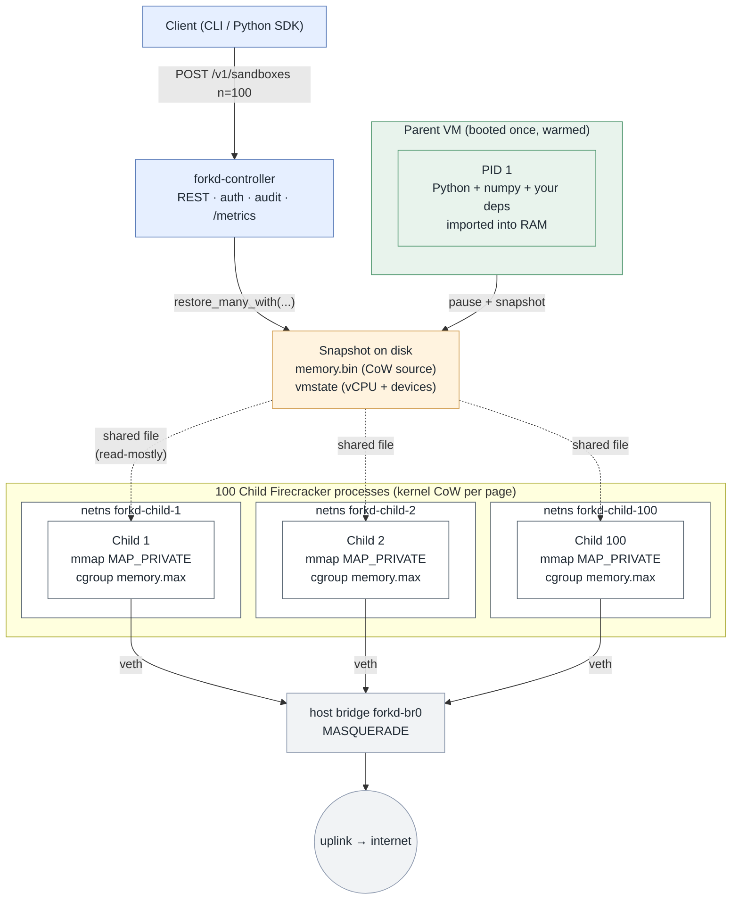

<br/>

<div align="center">
  <picture>
    <source media="(prefers-color-scheme: dark)" srcset="docs/logo-dark.svg">
    
  </picture>
</div>

<br/>
<br/>

<p align="center">
  <a href="https://github.com/deeplethe/forkd/actions"></a>
  <a href="https://github.com/deeplethe/forkd/releases"></a>
  <a href="https://pypi.org/project/forkd/"></a>
  <a href="./LICENSE"></a>
  <a href="./README-zh.md"></a>
  <a href="https://github.com/deeplethe/forkd/stargazers"></a>
</p>

<br/>

## Fork 100 microVMs in 101 ms. BRANCH a live VM in 56 ms (v0.4 live mode).

A microVM sandbox runtime for **AI agent fan-out**. Children fork
from a warmed parent snapshot, inheriting its address space
copy-on-write instead of cold-booting their own kernel.

forkd is built on Firecracker. The parent VM boots once, imports
your runtime (Python + your dependencies, a JIT-warmed JVM, an
already-loaded ML model) and is paused to disk. Each child is a
separate Firecracker process that `mmap`s the parent's memory image
with `MAP_PRIVATE`; the kernel implements copy-on-write at the page
level, so children share the parent's resident memory until they
diverge.

The result is two properties at once: per-child KVM isolation, and a
spawn cost that's closer to `fork(2)` than to a cold-boot VM.

forkd also supports **BRANCH**: pause a running sandbox, snapshot its
in-flight state, and resume — all in ~150 ms — so an agent can fork
mid-thought, not only at warm-up. v0.3.4 fixed a slow-path regression
where repeated BRANCHes on the same parent ballooned from 150 ms to
2.7 s ([#146](https://github.com/deeplethe/forkd/issues/146)); the
chain now stays flat (17.6× faster on the 6th consecutive BRANCH).

**v0.4 live BRANCH** collapses the source-pause window from ~200 ms
(Diff) to **56 ms p50 / 64 ms p90** on a 1.5 GiB source — measured
on a real BRANCH workload, [`bench/live-fork-pause-window/RESULTS-v0.4.md`](./bench/live-fork-pause-window/RESULTS-v0.4.md).
**3.6× faster pause** vs v0.3 Diff at p50, and the gap *widens* on
slower storage because Live's pause is disk-independent (memory
copy runs after resume, not during). With `wait: false` the caller
returns in ~70 ms while the background copy completes asynchronously
— a **200×** RT improvement for fire-and-forget BRANCH from agent
code. Pass `--live` / `--no-wait` on the CLI, `mode: "live"` /
`wait: false` on REST, or the same on the Python / TypeScript / MCP
SDKs.

```python
from forkd import Controller
c = Controller()
# Source must boot with live_fork=True (memfd-backed RAM, the prereq
# for UFFD_WP to see writes from the running parent).
parent = c.spawn_sandboxes("pyagent", n=1, live_fork=True)[0]
# ... drive parent ... then BRANCH live + fire-and-forget:
branch = c.branch_sandbox(parent["id"], mode="live", wait=False)
# Returns after ~10 ms with status="writing"; poll list_snapshots
# until status="ready" for the background copy to finish.
```

```bash
# Live BRANCH itself is exposed on the CLI (Phase 7.2):
sudo -E forkd snapshot --from-sandbox <sb-id> --live --no-wait
# Spawning with live_fork is REST/SDK-only today — `forkd fork
# --live-fork` is a follow-up; for now drive spawning via the SDK
# or POST /v1/sandboxes directly.
```

Requires Linux ≥ 5.7, `vm.unprivileged_userfaultfd=1` (or
`CAP_SYS_PTRACE`), and the vendored Firecracker fork from
[deeplethe/firecracker:forkd-v0.4-mem-backend-shared-v1.12](https://github.com/deeplethe/firecracker/tree/forkd-v0.4-mem-backend-shared-v1.12)
— `forkd doctor` probes both. Full design:
[`DESIGN-v0.4.md`](./DESIGN-v0.4.md). Empirical PoC data:
[`experiments/v0.4-*-poc/`](./experiments/). Tracking issue
[#101](https://github.com/deeplethe/forkd/issues/101).

<br/>

## Demo: branch a thinking agent

A 24-second walkthrough of the LangGraph branch-and-fan-out demo —
source agent runs a ReAct loop, gets BRANCHed mid-thought, three
grandchildren each receive a different steering hint, all three
produce divergent itineraries while inheriting the same prior
reasoning state.


Headline divergence: the source (no hint) picks Nishiki Market for
Day 1; all three hinted children independently substitute Arashiyama
Bamboo Grove. The cost-focused child also adds "may be pricey"
annotations the others don't. **The model wasn't told to swap places**
— each hint perturbed the next LLM call, the rest of the prior
reasoning came along unchanged.

Full mechanism + numbers + raw transcripts in
[`recipes/langgraph-react/`](./recipes/langgraph-react/) and
[`recipes/langgraph-react/DEMO.md`](./recipes/langgraph-react/DEMO.md).

### And: filesystem state, not just reasoning

For the "but couldn't you just call the LLM 3 times in parallel?"
objection, see [`recipes/coding-agent-fork/`](./recipes/coding-agent-fork/) —
a 50 MiB binary blob travels byte-identically across all 4 sandboxes
through a single BRANCH. Three grandchildren each apply a different
fix to a buggy Python package; their `__pycache__/` and edits stay
isolated, but the 50 MiB inheritance is shared. Bytes can't fit in
a prompt. **3.3 s pause for the BRANCH operation.**

<br/>

## Properties

- **Hardware isolation.** Each child is its own Firecracker microVM
  backed by KVM. Escape requires a hypervisor or kernel vulnerability,
  not a `runc` regression.
- **Warmed runtimes inherit for free.** Imports, JIT compilation, model
  weights, prefetched caches — anything the parent did is already
  resident in the child.
- **Real Linux per child.** Multi-vCPU, full TCP networking, `apt
  install`, outbound HTTPS. Unlike function-level snapshot runtimes
  that trade single-vCPU + serial-I/O for raw spawn speed, forkd
  children can run real Python servers, model inference, or any
  workload that needs a full kernel.
- **Multi-tenant by construction.** Per-child network namespace, per-
  child cgroup v2 memory limit, independent `/dev/urandom` re-seeded
  by `vmgenid` (Linux 5.20+).
- **Built for agent fan-out.** AI agent workloads that fan out into
  many short-lived sandboxes — code-interpreter, tool-use, evaluation
  rollouts — are the design point. The warmed parent collapses the
  per-request `import numpy` / `import torch` cost across the entire
  cohort.
- **Operable.** Daemon process owning state, REST API on Unix or TCP,
  Prometheus `/metrics`, append-only JSON audit log, systemd unit.
- **Open source.** Apache 2.0, no vendor SDK.

<br/>

## Benchmarks

Same Linux host (Ubuntu 24.04, Linux 6.14, 20 vCPU, 30 GiB, KVM).
Workload: spawn 100 sandboxes that each run `import numpy;
numpy.zeros(5).tolist()`.


| Backend | Wall-clock at N=100 | Memory delta per sandbox | Notes |
|---|---:|---:|---|
| **forkd** | **101 ms** | **0.12 MiB** | fork-from-warm via snapshot CoW |
| CubeSandbox¹ | 1.06 s | 5 MiB | RustVMM microVM, cold-boot (pool fast path) |
| BoxLite² | 113.2 s | — | KVM microVM, cold-boot OCI rootfs |
| OpenSandbox³ | 122.0 s | — | Docker runtime via abstraction layer |
| Firecracker cold-boot | 759 ms | 84 MiB | raw VM boot, no orchestration |
| gVisor (runsc) | 288.6 s | — | userspace kernel container |
| Docker (runc) | 335.3 s | 4 MiB | standard container runtime |

¹ CubeSandbox: 1.06 s wall-clock is the **fast-path** N=100 figure on
this host (1056 ± 14 ms over five runs, 100 % success every run),
measured with a bench script that pre-warms Python's
`ThreadPoolExecutor` to keep client-side lazy-init out of the
timing. An earlier slow-path measurement on the same host returned
20.3 s with 77/100 success — that template had a 2 GiB
writable-layer size that didn't match the default 1 GiB pool, so
every sandbox went through a live `mkfs.ext4 + reflink-copy`; after
the upstream maintainer at
[#235](https://github.com/TencentCloud/CubeSandbox/issues/235)
clarified the distinction, we added `2Gi` to
`pool_default_format_size_list` and re-ran. The host runs cube
**v0.2.0**, which carries a ~50 ms latency regression that
[PR #234](https://github.com/TencentCloud/CubeSandbox/pull/234)
fixes in v0.2.1; the value above is the v0.2.0 baseline. Cube
advertises **<60 ms** single-instance cold-start on a 96 vCPU
host; we did not retest that shape. See
[`bench/CUBESANDBOX.md`](./bench/CUBESANDBOX.md) for the full
methodology, both rows, and the `cmdTimeout` race we filed two PRs
upstream against
([#236](https://github.com/TencentCloud/CubeSandbox/pull/236) /
[#237](https://github.com/TencentCloud/CubeSandbox/pull/237)).

² BoxLite is optimised for one long-lived stateful Box per workload,
not 100 concurrent fresh microVMs. The cold fan-out is included for
direct comparability. See [`bench/BOXLITE.md`](./bench/BOXLITE.md).

³ OpenSandbox is an abstraction layer over Docker / K8s / gVisor /
Kata / Firecracker; the number is for its default Docker runtime.
See [`bench/OPENSANDBOX.md`](./bench/OPENSANDBOX.md).

Reproduce: `bench/bench-spawn-100.sh` then `bench/generate_charts.py`.

For one sandbox doing the same numpy expression two ways:

| Call | Time | What it does |
|---|---:|---|
| `sandbox.eval("numpy.zeros(5).tolist()")` | 1 ms | Reuses the warmed Python in PID 1 |
| `sandbox.commands.run("python3 -c '...'")` | 96 ms | Cold subprocess re-imports numpy |

<br/>

## How it works



See [`DESIGN.md`](./DESIGN.md) for the full design and the open
problems the architecture leaves on the table.

<br/>

## How forkd compares

The sandbox-runtime space has a wide spread of designs. The table
below summarises positioning of forkd against the most-cited
open-source projects. Numbers in quotes are **as advertised by the
upstream project** unless they match a row in our benchmark chart
above. forkd does not measure other projects on workloads they were
not designed for.

| Project | Primitive | Cold-start (N=100) | Fork-from-warm | Quotas | Auth / TLS | License |
|---|---|---|:---:|---|---|---|
| **forkd** | Firecracker + snapshot CoW | **101 ms** | ✓ | cgroup `memory.max` | bearer + rustls | Apache 2.0 |
| [CubeSandbox][cs] | RustVMM + KVM microVM | 1.06 s¹ | "coming soon" | <5 MiB / instance | not in OSS | Apache 2.0 |
| [Daytona][dy] | OCI workspace | <90 ms² | ✗ | per workspace | API keys (platform) | **AGPL-3.0** |
| [OpenSandbox][os] | Docker / K8s + gVisor / Kata / FC | 122 s | ✗ | via runtime | gateway (k8s) | Apache 2.0 |
| [E2B][e2b] | Firecracker (in [infra][e2b-infra]) | not in OSS | ✗ | platform | API keys (cloud) | Apache 2.0 |
| [BoxLite][bl] | KVM / Hypervisor.framework + OCI | 113 s | ✗ stateful Box | KVM + seccomp | egress policy only | Apache 2.0 |
| Modal | proprietary snapshot fork | not public | ✓ | ✓ | ✓ | proprietary |
| Firecracker raw | microVM only | 759 ms | manual | n/a | n/a | Apache 2.0 |
| Docker (runc) | OCI container | 335 s | ✗ | cgroups | n/a | Apache 2.0 |
| gVisor (runsc) | userspace kernel | 289 s | ✗ | cgroups | n/a | Apache 2.0 |

¹ Wall-clock at N=100 concurrent on this **bare-metal** host (`systemd-detect-virt: none`, i7-12700, 20 vCPU, no nested virt). This is the **fast-path** number — `pool_default_format_size_list` was extended to include the template's writable-layer size, so each sandbox reuses a pre-formatted pool entry rather than going through a live `mkfs.ext4 + reflink-copy`. 1056 ± 14 ms over five runs, 100 % success every run, measured with a bench script that pre-warms Python's `ThreadPoolExecutor` to keep client-side lazy-init out of the timing. Host runs cube **v0.2.0**, which carries a ~50 ms latency regression that [PR #234](https://github.com/TencentCloud/CubeSandbox/pull/234) fixes in v0.2.1 — the figure above is the v0.2.0 baseline. An earlier slow-path measurement on the same host (writable-layer size that didn't match the default pool) returned 20.3 s with 77/100 success — that mismatch was on our side and the maintainer corrected it at [#235](https://github.com/TencentCloud/CubeSandbox/issues/235). Cube advertises **<60 ms** single-instance cold-start (P99 200 ms at N=100 concurrent) under the fast-path configuration on a 96 vCPU host — that figure isn't disputed and we did not retest it here. Note also that this row compares **fork-from-warm (forkd)** with **cold-start (every other project)**; they're different operating points by design, not equivalent primitives. See [bench/CUBESANDBOX.md](./bench/CUBESANDBOX.md) for the full methodology, both rows, and the upstream cmdTimeout race we filed PRs [#236](https://github.com/TencentCloud/CubeSandbox/pull/236) / [#237](https://github.com/TencentCloud/CubeSandbox/pull/237) against.
² Daytona's advertised number; we did not measure it (workspace runtime, not a fan-out-comparable shape).

[cs]: https://github.com/TencentCloud/CubeSandbox
[dy]: https://github.com/daytonaio/daytona
[os]: https://github.com/alibaba/OpenSandbox
[e2b]: https://github.com/e2b-dev/E2B
[e2b-infra]: https://github.com/e2b-dev/infra
[bl]: https://github.com/boxlite-ai/boxlite

**Where forkd fits.**

- **Code interpreters and Jupyter-kernel sandboxes.** Each conversation
  turn or tool call spawns a fresh kernel; the warmed parent carries
  the SciPy / ML runtime, so per-request `import numpy` / `import torch`
  collapses to zero. This is the design point — the workload shape
  Anthropic / OpenAI / Modal code-interpreter products are all on.
- **Evaluation harnesses.** Hundreds of repository checkouts or test
  rollouts in parallel — SWE-bench-style — without paying Docker
  cold-start per task.
- **Per-user code execution at fan-out scale.** Many short-lived
  sandboxes sharing one warmed parent, each child KVM-isolated by
  construction.
- **Untrusted-code execution in CI.** `git clone`, `pip install`,
  `pytest` inside a real Linux VM, not a container namespace.
- **Self-hosted alternative to managed sandbox SaaS.** One Linux box
  with KVM, single-binary daemon, Apache 2.0 — no per-second cloud
  fees, no vendor lock-in.

**Where the others fit better.** CubeSandbox: faster pure cold-start
(<60 ms advertised). Daytona: workspace runtimes where each user owns
one long-lived sandbox. OpenSandbox: one orchestration API across
multiple isolation backends. BoxLite: embeddable, daemon-less,
cross-platform (macOS via Hypervisor.framework). Modal: the closed-
source managed system with the same primitive.

**Where forkd is wrong.** Function-level snapshot runtimes that give
up real Linux (single-vCPU, serial I/O only) beat forkd's ~100 ms by
an order of magnitude — at the cost of not running real Python
servers, `apt install`, or outbound HTTPS.

<br/>

## Enterprise deployment FAQ

Skim answers for platform / procurement teams scoping forkd:

**Can we deploy on Kubernetes?** Yes — one forkd-controller Pod hosts N sandbox children; the K8s scheduler runs **once** at Pod creation regardless of fan-out (vs one Pod-per-sandbox in Kata / Firecracker-on-K8s designs). A starter manifest ships at [`packaging/k8s/`](./packaging/k8s/). Requires nodes with `/dev/kvm` + cgroup v2; managed K8s (GKE / EKS / AKS) typically needs a metal SKU or explicit nested-virt to qualify.

**How many sandboxes fit in one Pod?** With a 512 MiB warmed Python+numpy parent, rough sizing:

- **~1 actively-running agent per vCPU** (compute-bound bottleneck)
- **~50 idle-pooled agents per 8 GiB Pod RAM** (process-state bottleneck, not memory)

Measured CoW overhead at N=100 is **0.12 MiB / child** on top of the parent ([bench/](./bench/)), so memory rarely caps fan-out — vCPU + process count dominate. Heavier parents (browser, ML inference) hit the ceiling sooner; measure with yours.

**How do existing agents connect?**

- **REST** — `POST /v1/sandboxes n=100`, language-agnostic, bearer-token auth
- **Python SDK** — `from forkd import Sandbox` (drop-in for `from e2b import Sandbox`)
- **LangGraph / AutoGen / CrewAI** — through the Python SDK, no special glue
- **MCP** — `pip install forkd-mcp` ships an MCP server for Claude Desktop / Claude Code / Cursor / Cline. See [`sdk/mcp/`](./sdk/mcp/)

**Production case shapes (from production users + this repo's recipes):**

- **AI code interpreter** — one warmed parent (SciPy / torch pre-imported), fork-per-conversation-turn. Recipe: [`e2b-codeinterpreter/`](./recipes/e2b-codeinterpreter/)
- **SWE-bench-style parallel evals** — N parallel repo checkouts, each child runs `pytest` isolated. Recipe: [`coding-agent/`](./recipes/coding-agent/)
- **Per-user code exec at scale** — shared warmed parent, child KVM-isolated per user
- **Untrusted CI** — `git clone + pip install + pytest` inside a real Linux VM, not a container namespace
- **Fork-per-test isolated databases** — recipe: [`postgres-fixture/`](./recipes/postgres-fixture/) — ready-to-query postgres at ~10 ms per child instead of ~2 s of fresh `initdb`

<br/>

## Quick start

Requires: x86_64 Linux with KVM, Ubuntu 22.04 or newer. Two steps to a real fork: set up the host (one-time), then `forkd pull` + fork (~30 s). The sections after that show alternative entry points for custom recipes.

### Confirm your host is ready

```bash
# 1. CLI + daemon binaries (pre-built tarball, no Rust toolchain needed):
curl -sSL https://github.com/deeplethe/forkd/releases/download/v0.3.4/forkd-v0.3.4-x86_64-linux.tar.gz \
  | sudo tar -xz -C /usr/local/bin/

# 2. Host bring-up:
sudo bash scripts/setup-host.sh           # KVM + tap device, one-time
sudo bash scripts/netns-setup.sh 3        # per-child network namespaces

# 3. Sanity-check:
forkd doctor                              # green-lights everything above

# 4. (Optional) language clients for programmatic use:
pip install forkd                         # Python SDK — calls the daemon over HTTP
npm install @deeplethe/forkd              # TypeScript SDK
```

`forkd doctor` runs 16 checks (KVM, hardware virt, cgroup v2, IP forward,
tap, netns, Firecracker binary + version, Docker daemon, snapshot dir +
disk space, kernel image, controller reachability, platform, plus
`uffd_wp` + `memfd_create` for the v0.4 live-fork path) and emits
specific fix hints for each non-pass. Run this first whenever something
feels off.


### Run your first fork (recommended)

```bash
# 14.5 MiB pack (Python 3.12 + LangGraph ready) → ~15 s download, sha256 verified.
forkd pull deeplethe/langgraph-react

# 3 children sharing the parent's memory, ~10 ms per child.
sudo -E forkd fork --tag langgraph -n 3 --per-child-netns
```

See [`docs/HUB.md`](./docs/HUB.md) for the registry model + how to
publish your own snapshot pack.

### Alternative: build from a Docker image

`forkd from-image` wraps Docker pull → ext4 → boot + warmup → pause →
register tag into a single verb. Use this when you need a recipe that
isn't on the Hub yet:

```bash
sudo -E forkd from-image python:3.12-slim \
    --tag py-numpy \
    --extra python3-numpy
# 2-3 min the first time (Docker pull + ext4 + warmup); cached after that.

sudo -E forkd fork --tag py-numpy -n 5 --per-child-netns
```

### Probe your install's latency

```bash
forkd bench --tag py-numpy --n 5
# forkd bench against snapshot py-numpy
#   spawn (n=1)              61 ms  sb-...-0027
#   exec round-trip          22 ms  exit=0
#   branch (diff=true)      287 ms  pause_ms=234 diff_physical_bytes=393216
#   fanout (n=5)             65 ms  13ms/child
#   cleanup                 136 ms
#                           -----
#   total                   571 ms
```

Run this against any snapshot to see how forkd actually performs on
your hardware. Screenshot-friendly output.

### Alternative: build from source (advanced)

```bash
# 1. Host setup: KVM, Firecracker, Rust, KSM, hugepages, tap device.
sudo bash scripts/setup-host.sh
sudo bash scripts/host-tap.sh
cargo build --release
sudo install -m 0755 target/release/{forkd,forkd-controller} /usr/local/bin/

# 2. Build a warmed rootfs from a Docker image.
sudo bash scripts/build-rootfs.sh python:3.12-slim python-rootfs.ext4 1536 python3-numpy

# 3. Fetch a kernel.
curl -O https://s3.amazonaws.com/spec.ccfc.min/firecracker-ci/v1.10/x86_64/vmlinux-6.1.141

# 4. Run a one-shot sandbox.
sudo -E forkd run --image python:3.12-slim --kernel ./vmlinux-6.1.141 \
    -- python3 -c "import numpy; print(numpy.zeros(5).sum())"
# 0.0
```

### Multi-child fork-out

```bash
# Provision N per-child network namespaces (one-time per N).
sudo bash scripts/netns-setup.sh 100

# Create a tagged parent snapshot.
sudo forkd snapshot --tag pyagent \
    --kernel ./vmlinux-6.1.141 \
    --rootfs ./python-rootfs.ext4 \
    --tap forkd-tap0

# Fork 100 children sharing the parent's memory.
sudo -E forkd fork --tag pyagent -n 100 --per-child-netns --memory-limit-mib 256

# Talk to one of them.
sudo forkd eval --child forkd-child-42 -- "numpy.zeros(100).sum()"
```

### Python SDK

In-guest agent (E2B-compatible):

```python
from forkd import Sandbox   # drop-in for `from e2b import Sandbox`

with Sandbox() as sb:
    print(sb.commands.run("uname -a").stdout)
    print(sb.eval("numpy.zeros(5).tolist()"))    # reuses warmed PID 1
```

Controller daemon (lifecycle + branching):

```python
from forkd import Controller

c = Controller()                                  # http://127.0.0.1:8889
children = c.spawn_sandboxes("pyagent", n=1, per_child_netns=True,
                             live_fork=True)      # v0.4: enables `mode="live"` later
sb_id = children[0]["id"]

# … drive sb_id via in-guest Sandbox, then branch before a risky step.
# `mode="live"` collapses source pause to sub-50 ms (vs ~200 ms for diff);
# `wait=False` returns after the source resumes (~10 ms), background
# copy finishes asynchronously — poll list_snapshots for status="ready".
branch = c.branch_sandbox(sb_id, tag="checkpoint-1", mode="live", wait=False)
grandchildren = c.spawn_sandboxes(branch["tag"], n=5)  # speculative fan-out
```

See [`docs/design/branching.md`](./docs/design/branching.md) for the
fork-from-warm tree model and use cases.

### TypeScript SDK

For Node.js 18+ agents (LangChain.js, agent-twins, anything JS-side):

```bash
npm install @deeplethe/forkd
```

```ts
import { Controller } from '@deeplethe/forkd';

const ctrl = new Controller();   // reads FORKD_URL, FORKD_TOKEN from env
const [parent] = await ctrl.spawnSandboxes({
  snapshotTag: 'pyagent', n: 1, perChildNetns: true,
  liveFork: true,             // v0.4: enables { mode: 'live' } later
});

// ... drive parent via REST/HTTP ...
// `mode: 'live'` + `wait: false` = source pauses sub-50 ms and the
// caller returns after ~10 ms; the background memory copy completes
// asynchronously, snapshot reaches `status: 'ready'` afterward.
const branch = await ctrl.branchSandbox(parent.id, { mode: 'live', wait: false });
const kids = await ctrl.spawnSandboxes({ snapshotTag: branch.tag, n: 5, perChildNetns: true });
```

Surface parity with the Python SDK: `spawnSandboxes` / `branchSandbox`
take the same `prewarm` / `liveFork` / `mode` / `wait` /
`measure_diff` options. See
[`sdk/typescript/`](./sdk/typescript/).

### MCP server

For Claude Desktop, Claude Code, Cursor, and any other
[MCP](https://modelcontextprotocol.io/)-aware client:

```bash
pip install forkd-mcp
# then add to claude_desktop_config.json:
#   "mcpServers": { "forkd": { "command": "forkd-mcp" } }
```

The server exposes `spawn_sandboxes`, `exec_command`, `eval_code`,
and five other tools — the agent can fork and drive forkd microVMs
directly. See [`sdk/mcp/README.md`](./sdk/mcp/README.md).

### Framework integration recipes (host-side, no rootfs build)

Drop-in patterns for the four agent frameworks most often used with
forkd. Each is ~150-250 lines of Python with a `--dry-run` mode that
exercises the forkd plumbing without an LLM key:

| Recipe | Driver | Forkd-specific move |
|---|---|---|
| [`mcp-agent/`](./recipes/mcp-agent/) | Claude Desktop / Cursor / Cline (MCP) | End-to-end MCP protocol verification |
| [`crewai-fanout/`](./recipes/crewai-fanout/) | CrewAI | N agents on N microVMs from one parent — per-agent isolation, ~24ms per child |
| [`autogen-branch/`](./recipes/autogen-branch/) | AutoGen | Forkd-backed `CodeExecutor` + mid-conversation BRANCH that fans out N alternatives |
| [`openai-swarm/`](./recipes/openai-swarm/) | OpenAI Swarm / Agents SDK | Handoff = BRANCH: agent B inherits agent A's full VM state |

### Pre-built rootfs recipes

Skip the rootfs design step — pick one of the [`recipes/`](./recipes/)
and run its `build.sh`:

| Recipe | When to pick |
|---|---|
| [`python-numpy/`](./recipes/python-numpy/) | Reproduce the benchmark; lightest Python + numpy |
| [`e2b-codeinterpreter/`](./recipes/e2b-codeinterpreter/) | AI code-interpreter agents (E2B SDK-compatible) |
| [`jupyter-kernel/`](./recipes/jupyter-kernel/) | Notebook / SciPy stack pre-imported; ~1 ms per kernel |
| [`coding-agent/`](./recipes/coding-agent/) | SWE-bench / coding agents with `git` + dev tools |
| [`nodejs/`](./recipes/nodejs/) | JS / TS workloads, Playwright fan-out |
| [`playwright-browser/`](./recipes/playwright-browser/) | Browser-driving agents (computer-use, web research, UI test gen). Fork warmed Chromium at ~10 ms |
| [`agent-workbench/`](./recipes/agent-workbench/) | Kitchen sink — browser + VSCode + Jupyter + MCP |
| [`postgres-fixture/`](./recipes/postgres-fixture/) | Fork-per-test isolated postgres; ready-to-query in ~10 ms instead of ~2 s of fresh initdb |

### Snapshot Hub (skip the rootfs build entirely)

Once a parent snapshot is built (yours or someone else's), `forkd pack`
ships it as a single `.tar.zst` file with a manifest + per-file sha256.
Other hosts pull and resume forking in seconds, no Docker round-trip:

```bash
# producer host
forkd pack --tag pyagent --out pyagent.forkd-snapshot.tar.zst
# 23× compression typical — pyagent's 512 MiB memory.bin → ~22 MiB on disk

# upload to an R2 / S3 bucket
forkd push --tag pyagent "https://<your-presigned-PUT-url>"

# consumer host
forkd pull https://hub.example.com/pyagent.forkd-snapshot.tar.zst
forkd fork --tag pyagent -n 100 --per-child-netns   # already warm
```

`forkd images` lists local snapshots with their sizes. Integrity is
verified on unpack via the manifest's sha256s.

<br/>

## Operating in daemon mode

The controller daemon owns the registry of snapshots and live
sandboxes, exposes the REST API, and writes structured audit logs.
Recommended for any deployment beyond local development.

```bash
sudo install -m 0644 packaging/systemd/forkd-controller.service /etc/systemd/system/
sudo mkdir -p /etc/forkd
sudo bash -c 'head -c 32 /dev/urandom | base64 > /etc/forkd/token'
sudo chmod 600 /etc/forkd/token
sudo systemctl enable --now forkd-controller
```

Then drive it over HTTP:

```bash
TOKEN=$(sudo cat /etc/forkd/token)
curl -H "Authorization: Bearer $TOKEN" -X POST http://127.0.0.1:8889/v1/sandboxes \
     -H 'Content-Type: application/json' \
     -d '{"snapshot_tag":"pyagent","n":5,"per_child_netns":true,"memory_limit_mib":256}'
# [{"id":"sb-67a1b3-0000","pid":...,...}, ...]

curl -H "Authorization: Bearer $TOKEN" http://127.0.0.1:8889/metrics
# forkd_sandboxes_active 5
```

Full API reference: [`docs/API.md`](./docs/API.md).
Operator runbook: [`docs/RUNBOOK.md`](./docs/RUNBOOK.md).
Security posture: [`docs/SECURITY.md`](./docs/SECURITY.md).

<br/>

## Repository layout

```
crates/
  forkd-vmm/            Firecracker wrapper: BootConfig, Vm, Snapshot, cgroup
  forkd-cli/            `forkd` binary (snapshot, fork, run, exec, eval,
                        pack/unpack/pull/push/images, cleanup)
  forkd-controller/     `forkd-controller` daemon: REST, registry, audit
rootfs-init/
  forkd-init.sh         PID 1 inside the guest; mounts pseudo-fs, launches agent
  forkd-agent.py        TCP server on :8888 inside the guest (ping/exec/eval)
sdk/python/             E2B-compatible Python SDK
sdk/mcp/                MCP server (`forkd-mcp`) — drive forkd from
                        Claude Desktop / Claude Code / any MCP client
scripts/                Host-side helpers (KVM, Firecracker, netns, rootfs)
packaging/systemd/      systemd unit for the controller
packaging/k8s/          Starter Kubernetes manifest for forkd-controller
recipes/                Framework integration recipes (mcp-agent,
                        crewai-fanout, autogen-branch, openai-swarm)
                        + parent-rootfs recipes (python-numpy,
                        e2b-codeinterpreter, jupyter-kernel, coding-agent,
                        nodejs, playwright-browser, agent-workbench,
                        postgres-fixture). See recipes/README.md.
bench/                  Benchmark harness, chart generators, results
docs/                   API.md, SECURITY.md, RUNBOOK.md
```

<br/>

## Status

Alpha. The fork-on-write primitive, controller daemon, REST API,
auth, audit logging, cgroup memory limits, Prometheus metrics, and
Python + TypeScript SDKs are in place and exercised by 25 unit +
integration tests in CI. On-disk formats and API shapes may still
change before 1.0.

Production-readiness items not yet in this release:

- Multi-node scheduling (one daemon = one host).
- Default-deny egress on per-child netns (today: shared MASQUERADE
  rule; users wanting an allow-list policy add their own `iptables`
  rules per netns).
- cpu.max, io.max, pids.max quotas beyond the existing
  `memory.max`.
- Third-party security audit.

Roadmap (v0.3 candidates + production-readiness gaps): [docs/ROADMAP.md](./docs/ROADMAP.md).
Issue-level tracking: [GitHub issues](https://github.com/deeplethe/forkd/issues).
Release notes per version: [CHANGELOG.md](./CHANGELOG.md).
Security posture and past advisories: [docs/SECURITY.md](./docs/SECURITY.md).

**v0.3 phase 1 shipped (v0.3.0 → v0.3.4)** — diff-snapshot BRANCH
cuts source-pause window from **29.3 s to 205 ms (143×) on a 4 GiB
SSD source** (idle); typical agent workload (30-300 MiB dirty)
**6-15×**. Multi-BRANCH on the same sandbox works in v0.3.1 — 5
consecutive diff BRANCHes give a **14× aggregate** downtime reduction
vs Full. v0.3.2 closes the SDK surface-parity gap: Python SDK
`spawn_sandboxes(prewarm=...)` and `branch_sandbox(diff=..., measure_diff=...)`
now match the REST and TypeScript SDK options. **v0.3.4 closes the
multi-BRANCH pause anomaly ([#146](https://github.com/deeplethe/forkd/issues/146))** —
a 30-line `posix_fallocate` fix bypasses ext4's writeback-throttle
compounding, so the 6th consecutive BRANCH stays at ~150 ms instead
of climbing to 2.7 s (17.6× faster). Full table and
honest caveats in
[`bench/pause-window/RESULTS-v0.3.md`](./bench/pause-window/RESULTS-v0.3.md);
75-trial sweep raw data in `bench/pause-window/*-sweep-*.csv`.
Opt in by setting `"diff": true` on `POST /v1/sandboxes/:id/branch`,
or use the `--diff` flag on `forkd snapshot --from-sandbox`.

The win is the source's **downtime**, not the total BRANCH API
latency: a background `cp` of the source's memory.bin runs in
parallel with the source itself, then the diff window closes,
source resumes, the diff is merged onto the pre-copied output.
Source TCP connections, kvmclock, and timers see a ~200 ms gap
instead of 29 s. Total BRANCH API time is still bandwidth-bound
on the cp; the trade-off favors live BRANCH from a long-running
agent.

v0.3.1's multi-BRANCH support uses the previous BRANCH's output as
the chain head — no separate shadow file, zero extra storage. If
the user `DELETE`s an intermediate BRANCH snapshot, the chain
detects the missing file and falls back to the source-tag base with
a logged warning. Full design:
[`docs/design/diff-snapshots.md`](./docs/design/diff-snapshots.md).

**v0.4 live BRANCH** is wired up end-to-end on the user surface
(REST `mode: "live"`, CLI `--live`, Python / TypeScript / MCP SDKs;
PRs [#204](https://github.com/deeplethe/forkd/pull/204)–[#207](https://github.com/deeplethe/forkd/pull/207)).
The mechanism: spawn with `live_fork: true` to back guest RAM with a
memfd shared between Firecracker and the controller, then BRANCH with
UFFD_WP capturing dirty pages out-of-band so the source resumes
immediately after vCPU dump (sub-50 ms) and the memory copy completes
asynchronously. We initially planned to stay on vanilla FC, but
`mem_backend.backend_type: "Shared"` with `shared: true` is the one
upstream gap we couldn't work around without `mmap MAP_SHARED` —
hence the vendored fork at
[deeplethe/firecracker:forkd-v0.4-mem-backend-shared-v1.12](https://github.com/deeplethe/firecracker/tree/forkd-v0.4-mem-backend-shared-v1.12).
We have an open upstream proposal
([`FIRECRACKER-UPSTREAM-PROPOSAL.md`](./FIRECRACKER-UPSTREAM-PROPOSAL.md));
once that lands, the vendor requirement goes away. Tracking issue:
[#101](https://github.com/deeplethe/forkd/issues/101). Bench numbers
on a clean parent (`bench/live-fork-pause-window.md`) are in progress
— Phase 6 E2E captured pause_ms = 41-48 ms in early tests but the
parent had pre-baked guest Oopses contaminating the measurement.

> **0.1.4 contains daemon security fixes.** Two HIGH-class
> validation gaps in `POST /v1/sandboxes` (path-traversal via
> `snapshot_tag`) and `packaging/k8s/` (placeholder bearer token
> accepted at startup) affected 0.1.0–0.1.3 inclusive; users on
> those versions should upgrade. Full advisories in
> [docs/SECURITY.md#past-advisories](./docs/SECURITY.md#past-advisories).
> 0.1.3 also fixed a CLI `--tag` path-traversal (affected 0.1.0–0.1.2).

<br/>

## Contributing

Pull requests welcome. Before opening one, please:

1. Open an issue describing what you want to change. APIs are still
   moving; we'd rather align early than ask you to rewrite the patch.
2. `cargo fmt --all && cargo clippy --all-targets -- -D warnings && cargo test --all` locally.
3. Sign-off your commits (`git commit -s`).

<br/>

## Star history

<a href="https://star-history.com/#deeplethe/forkd&Date">
  <picture>
    <source media="(prefers-color-scheme: dark)" srcset="https://api.star-history.com/svg?repos=deeplethe/forkd&type=Date&theme=dark">
    
  </picture>
</a>

<br/>

## License

Apache 2.0. See [LICENSE](./LICENSE) and [NOTICE](./NOTICE).
