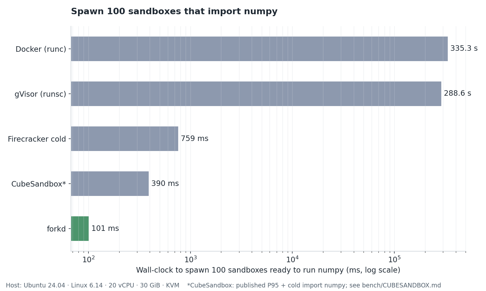
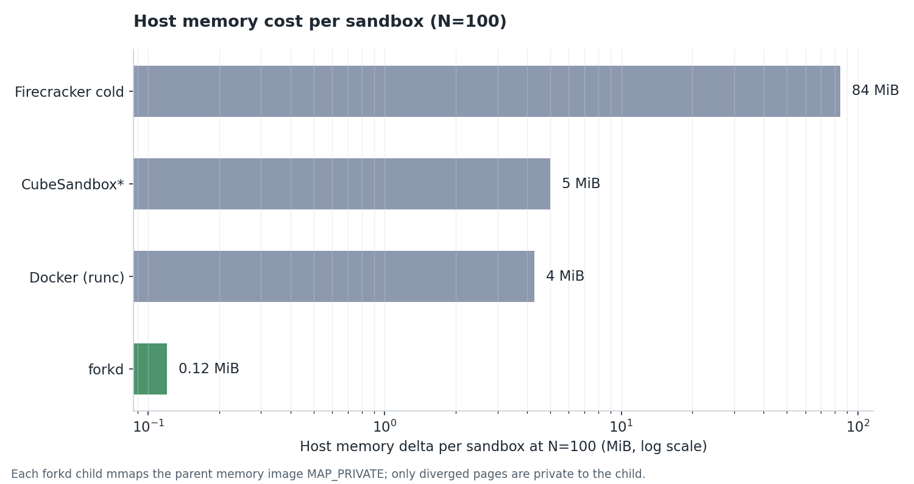
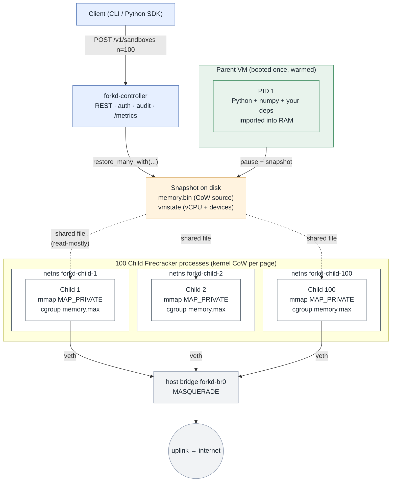

<br/>

<div align="center">
  <picture>
    <source media="(prefers-color-scheme: dark)" srcset="docs/logo-dark.svg">
    
  </picture>
</div>

<br/>
<br/>

<p align="center">
  <a href="https://github.com/deeplethe/forkd/actions"></a>
  <a href="https://github.com/deeplethe/forkd/releases"></a>
  <a href="./LICENSE"></a>
  <a href="https://firecracker-microvm.github.io"></a>
  <a href="https://github.com/deeplethe/forkd/stargazers"></a>
</p>

<br/>

## Fork 100 microVMs in 101 ms.

A microVM sandbox runtime for **AI agent fan-out**. Children fork
from a warmed parent snapshot, inheriting its address space
copy-on-write instead of cold-booting their own kernel.

forkd is built on Firecracker. The parent VM boots once, imports
your runtime (Python + your dependencies, a JIT-warmed JVM, an
already-loaded ML model) and is paused to disk. Each child is a
separate Firecracker process that `mmap`s the parent's memory image
with `MAP_PRIVATE`; the kernel implements copy-on-write at the page
level, so children share the parent's resident memory until they
diverge.

The result is two properties at once: per-child KVM isolation, and a
spawn cost that's closer to `fork(2)` than to a cold-boot VM.

<br/>

## Properties

- **Hardware isolation.** Each child is its own Firecracker microVM
  backed by KVM. Escape requires a hypervisor or kernel vulnerability,
  not a `runc` regression.
- **Warmed runtimes inherit for free.** Imports, JIT compilation, model
  weights, prefetched caches — anything the parent did is already
  resident in the child.
- **Real Linux per child.** Multi-vCPU, full TCP networking, `apt
  install`, outbound HTTPS. Unlike function-level snapshot runtimes
  that trade single-vCPU + serial-I/O for raw spawn speed, forkd
  children can run real Python servers, model inference, or any
  workload that needs a full kernel.
- **Multi-tenant by construction.** Per-child network namespace, per-
  child cgroup v2 memory limit, independent `/dev/urandom` re-seeded
  by `vmgenid` (Linux 5.20+).
- **Built for agent fan-out.** AI agent workloads that fan out into
  many short-lived sandboxes — code-interpreter, tool-use, evaluation
  rollouts — are the design point. The warmed parent collapses the
  per-request `import numpy` / `import torch` cost across the entire
  cohort.
- **Operable.** Daemon process owning state, REST API on Unix or TCP,
  Prometheus `/metrics`, append-only JSON audit log, systemd unit.
- **Open source.** Apache 2.0, no vendor SDK.

<br/>

## Benchmarks

Same Linux host (Ubuntu 24.04, Linux 6.14, 20 vCPU, 30 GiB, KVM).
Workload: spawn 100 sandboxes that each run `import numpy;
numpy.zeros(5).tolist()`.





| Backend | Wall-clock at N=100 | Memory delta per sandbox | Notes |
|---|---:|---:|---|
| **forkd** | **101 ms** | **0.12 MiB** | fork-from-warm via snapshot CoW |
| CubeSandbox¹ | 20.3 s | 5 MiB | RustVMM microVM, cold-boot |
| BoxLite² | 113.2 s | — | KVM microVM, cold-boot OCI rootfs |
| OpenSandbox³ | 122.0 s | — | Docker runtime via abstraction layer |
| Firecracker cold-boot | 759 ms | 84 MiB | raw VM boot, no orchestration |
| gVisor (runsc) | 288.6 s | — | userspace kernel container |
| Docker (runc) | 335.3 s | 4 MiB | standard container runtime |

¹ CubeSandbox: 77 of 100 sandboxes spawned cleanly; the rest hit
reflink-copy storage errors under concurrent load on this host. See
[`bench/CUBESANDBOX.md`](./bench/CUBESANDBOX.md).

² BoxLite is optimised for one long-lived stateful Box per workload,
not 100 concurrent fresh microVMs. The cold fan-out is included for
direct comparability. See [`bench/BOXLITE.md`](./bench/BOXLITE.md).

³ OpenSandbox is an abstraction layer over Docker / K8s / gVisor /
Kata / Firecracker; the number is for its default Docker runtime.
See [`bench/OPENSANDBOX.md`](./bench/OPENSANDBOX.md).

Reproduce: `bench/bench-spawn-100.sh` then `bench/generate_charts.py`.

For one sandbox doing the same numpy expression two ways:

| Call | Time | What it does |
|---|---:|---|
| `sandbox.eval("numpy.zeros(5).tolist()")` | 1 ms | Reuses the warmed Python in PID 1 |
| `sandbox.commands.run("python3 -c '...'")` | 96 ms | Cold subprocess re-imports numpy |

<br/>

## How it works



See [`DESIGN.md`](./DESIGN.md) for the full design and the open
problems the architecture leaves on the table.

<br/>

## How forkd compares

The sandbox-runtime space has a wide spread of designs. The table
below summarises positioning of forkd against the most-cited
open-source projects. Numbers in quotes are **as advertised by the
upstream project** unless they match a row in our benchmark chart
above. forkd does not measure other projects on workloads they were
not designed for.

| Project | Primitive | Cold-start (N=100) | Fork-from-warm | Quotas | Auth / TLS | License |
|---|---|---|:---:|---|---|---|
| **forkd** | Firecracker + snapshot CoW | **101 ms** | ✓ | cgroup `memory.max` | bearer + rustls | Apache 2.0 |
| [CubeSandbox][cs] | RustVMM + KVM microVM | 20.3 s¹ | "coming soon" | <5 MiB / instance | not in OSS | Apache 2.0 |
| [Daytona][dy] | OCI workspace | <90 ms² | ✗ | per workspace | API keys (platform) | **AGPL-3.0** |
| [OpenSandbox][os] | Docker / K8s + gVisor / Kata / FC | 122 s | ✗ | via runtime | gateway (k8s) | Apache 2.0 |
| [E2B][e2b] | Firecracker (in [infra][e2b-infra]) | not in OSS | ✗ | platform | API keys (cloud) | Apache 2.0 |
| [BoxLite][bl] | KVM / Hypervisor.framework + OCI | 113 s | ✗ stateful Box | KVM + seccomp | egress policy only | Apache 2.0 |
| Modal | proprietary snapshot fork | not public | ✓ | ✓ | ✓ | proprietary |
| Firecracker raw | microVM only | 759 ms | manual | n/a | n/a | Apache 2.0 |
| Docker (runc) | OCI container | 335 s | ✗ | cgroups | n/a | Apache 2.0 |
| gVisor (runsc) | userspace kernel | 289 s | ✗ | cgroups | n/a | Apache 2.0 |

¹ 77/100 succeeded on this host due to a reflink-copy storage bug under concurrent load; CubeSandbox advertises **<60 ms** single-instance cold-start (P95 90 ms at 50-concurrent). See [bench/CUBESANDBOX.md](./bench/CUBESANDBOX.md).
² Daytona's advertised number; we did not measure it (workspace runtime, not a fan-out-comparable shape).

[cs]: https://github.com/TencentCloud/CubeSandbox
[dy]: https://github.com/daytonaio/daytona
[os]: https://github.com/alibaba/OpenSandbox
[e2b]: https://github.com/e2b-dev/E2B
[e2b-infra]: https://github.com/e2b-dev/infra
[bl]: https://github.com/boxlite-ai/boxlite

**Where forkd fits.**

- **Code interpreters and tool-use sandboxes.** Each conversation
  turn or tool call spawns a fresh isolated child; the warmed parent
  carries the runtime, so per-request `import numpy` / `import torch`
  collapses to zero.
- **Evaluation harnesses.** Hundreds of repository checkouts or test
  rollouts in parallel — SWE-bench-style — without paying Docker
  cold-start per task.
- **Per-user code execution at fan-out scale.** Many short-lived
  sandboxes sharing one warmed parent, each child KVM-isolated by
  construction.
- **Untrusted-code execution in CI.** `git clone`, `pip install`,
  `pytest` inside a real Linux VM, not a container namespace.
- **Self-hosted alternative to managed sandbox SaaS.** One Linux box
  with KVM, single-binary daemon, Apache 2.0 — no per-second cloud
  fees, no vendor lock-in.

**Where the others fit better.** CubeSandbox: faster pure cold-start
(<60 ms advertised). Daytona: workspace runtimes where each user owns
one long-lived sandbox. OpenSandbox: one orchestration API across
multiple isolation backends. BoxLite: embeddable, daemon-less,
cross-platform (macOS via Hypervisor.framework). Modal: the closed-
source managed system with the same primitive.

**Where forkd is wrong.** Function-level snapshot runtimes that give
up real Linux (single-vCPU, serial I/O only) beat forkd's ~100 ms by
an order of magnitude — at the cost of not running real Python
servers, `apt install`, or outbound HTTPS.

<br/>

## Quick start

Requires: x86_64 Linux with KVM, Ubuntu 22.04 or newer.

```bash
# 1. Host setup: KVM, Firecracker, Rust, KSM, hugepages, tap device.
sudo bash scripts/setup-host.sh
sudo bash scripts/host-tap.sh
cargo build --release
sudo install -m 0755 target/release/{forkd,forkd-controller} /usr/local/bin/

# 2. Build a warmed rootfs from a Docker image.
sudo bash scripts/build-rootfs.sh python:3.12-slim python-rootfs.ext4 1536 python3-numpy

# 3. Fetch a kernel.
curl -O https://s3.amazonaws.com/spec.ccfc.min/firecracker-ci/v1.10/x86_64/vmlinux-6.1.141

# 4. Run a one-shot sandbox.
sudo -E forkd run --image python:3.12-slim --kernel ./vmlinux-6.1.141 \
    -- python3 -c "import numpy; print(numpy.zeros(5).sum())"
# 0.0
```

### Multi-child fork-out

```bash
# Provision N per-child network namespaces (one-time per N).
sudo bash scripts/netns-setup.sh 100

# Create a tagged parent snapshot.
sudo forkd snapshot --tag pyagent \
    --kernel ./vmlinux-6.1.141 \
    --rootfs ./python-rootfs.ext4 \
    --tap forkd-tap0

# Fork 100 children sharing the parent's memory.
sudo -E forkd fork --tag pyagent -n 100 --per-child-netns --memory-limit-mib 256

# Talk to one of them.
sudo forkd eval --child forkd-child-42 -- "numpy.zeros(100).sum()"
```

### Python SDK

```python
from forkd import Sandbox   # drop-in for `from e2b import Sandbox`

with Sandbox() as sb:
    print(sb.commands.run("uname -a").stdout)
    print(sb.eval("numpy.zeros(5).tolist()"))    # reuses warmed PID 1
```

### Pre-built recipes

Skip the rootfs design step — pick one of the [`recipes/`](./recipes/)
and run its `build.sh`:

| Recipe | When to pick |
|---|---|
| [`python-numpy/`](./recipes/python-numpy/) | Reproduce the benchmark; lightest Python + numpy |
| [`e2b-codeinterpreter/`](./recipes/e2b-codeinterpreter/) | AI code-interpreter agents (E2B SDK-compatible) |
| [`coding-agent/`](./recipes/coding-agent/) | SWE-bench / coding agents with `git` + dev tools |
| [`nodejs/`](./recipes/nodejs/) | JS / TS workloads, Playwright fan-out |
| [`agent-workbench/`](./recipes/agent-workbench/) | Kitchen sink — browser + VSCode + Jupyter + MCP |

<br/>

## Operating in daemon mode

The controller daemon owns the registry of snapshots and live
sandboxes, exposes the REST API, and writes structured audit logs.
Recommended for any deployment beyond local development.

```bash
sudo install -m 0644 packaging/systemd/forkd-controller.service /etc/systemd/system/
sudo mkdir -p /etc/forkd
sudo bash -c 'head -c 32 /dev/urandom | base64 > /etc/forkd/token'
sudo chmod 600 /etc/forkd/token
sudo systemctl enable --now forkd-controller
```

Then drive it over HTTP:

```bash
TOKEN=$(sudo cat /etc/forkd/token)
curl -H "Authorization: Bearer $TOKEN" -X POST http://127.0.0.1:8889/v1/sandboxes \
     -H 'Content-Type: application/json' \
     -d '{"snapshot_tag":"pyagent","n":5,"per_child_netns":true,"memory_limit_mib":256}'
# [{"id":"sb-67a1b3-0000","pid":...,...}, ...]

curl -H "Authorization: Bearer $TOKEN" http://127.0.0.1:8889/metrics
# forkd_sandboxes_active 5
```

Full API reference: [`docs/API.md`](./docs/API.md).
Operator runbook: [`docs/RUNBOOK.md`](./docs/RUNBOOK.md).
Security posture: [`docs/SECURITY.md`](./docs/SECURITY.md).

<br/>

## Repository layout

```
crates/
  forkd-vmm/            Firecracker wrapper: BootConfig, Vm, Snapshot, cgroup
  forkd-cli/            `forkd` binary (snapshot, fork, run, exec, eval)
  forkd-controller/     `forkd-controller` daemon: REST, registry, audit
rootfs-init/
  forkd-init.sh         PID 1 inside the guest; mounts pseudo-fs, launches agent
  forkd-agent.py        TCP server on :8888 inside the guest (ping/exec/eval)
sdk/python/             E2B-compatible Python SDK
scripts/                Host-side helpers (KVM, Firecracker, netns, rootfs)
packaging/systemd/      systemd unit for the controller
recipes/                Pre-built parent-rootfs recipes (python-numpy,
                        e2b-codeinterpreter, coding-agent, nodejs,
                        agent-workbench). See recipes/README.md.
bench/                  Benchmark harness, chart generators, results
docs/                   API.md, SECURITY.md, RUNBOOK.md
```

<br/>

## Status

Alpha. The fork-on-write primitive, controller daemon, REST API,
auth, audit logging, cgroup memory limits, Prometheus metrics, and
Python SDK are in place and exercised by 25 unit + integration tests
in CI. On-disk formats and API shapes may still change before 1.0.

Production-readiness items not yet in this release:

- Multi-node scheduling (one daemon = one host).
- TLS termination — front the daemon with a reverse proxy for
  non-loopback access.
- Default-deny egress on per-child netns (today: shared MASQUERADE
  rule; users wanting an allow-list policy add their own `iptables`
  rules per netns).
- cpu.max, io.max, pids.max quotas beyond the existing
  `memory.max`.
- Third-party security audit.

The roadmap and tracked work live in [GitHub issues](https://github.com/deeplethe/forkd/issues).

<br/>

## Contributing

Pull requests welcome. Before opening one, please:

1. Open an issue describing what you want to change. APIs are still
   moving; we'd rather align early than ask you to rewrite the patch.
2. `cargo fmt --all && cargo clippy --all-targets -- -D warnings && cargo test --all` locally.
3. Sign-off your commits (`git commit -s`).

<br/>

## Star history

<a href="https://star-history.com/#deeplethe/forkd&Date">
  <picture>
    <source media="(prefers-color-scheme: dark)" srcset="https://api.star-history.com/svg?repos=deeplethe/forkd&type=Date&theme=dark">
    
  </picture>
</a>

<br/>

## License

Apache 2.0. See [LICENSE](./LICENSE) and [NOTICE](./NOTICE).
